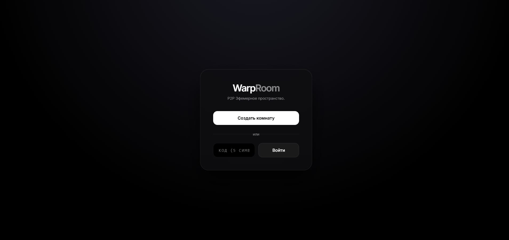
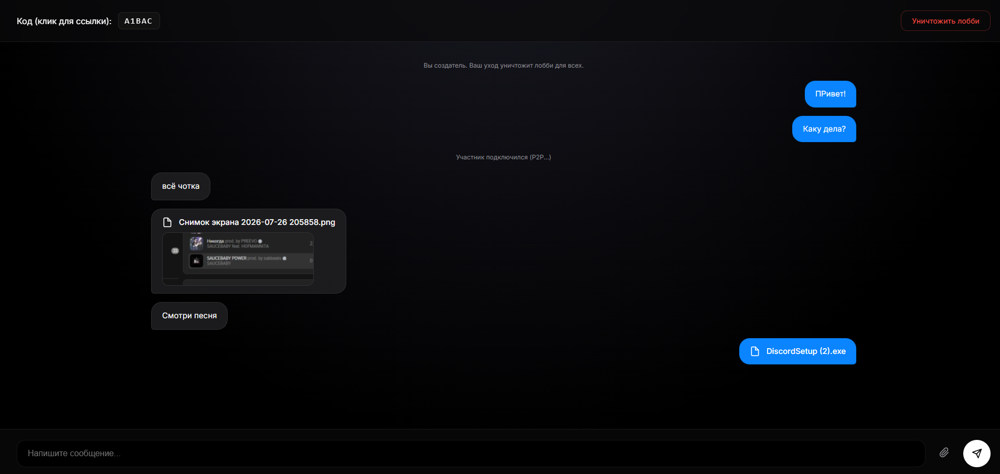

# 🌌 WarpRoom

**WarpRoom** — это эфемерное P2P-пространство для мгновенного обмена текстом и файлами. Убийца флешек, костылей вроде чата «Избранное» в мессенджерах и ограничений AirDrop.

Максимальная приватность, нулевое трение (zero-friction) и передача данных напрямую от устройства к устройству. Как только создатель закрывает лобби — комната и вся ее история навсегда растворяются. Никаких баз данных и логов.

## ✨ Ключевые особенности

- **P2P Передача файлов (WebRTC):** Файлы любого размера передаются напрямую между браузерами, минуя сервер. Сервер не видит ваши файлы и не расходует свою оперативную память.
- **Полная эфемерность:** Сообщения хранятся только в ОЗУ сервера. Как только лобби уничтожается, сборщик мусора Go навсегда удаляет следы существования комнаты.
- **Поддержка тяжелых файлов:** Файлы нарезаются на чанки (по 64KB) с механизмом backpressure, что позволяет передавать гигабайтные данные без потери пакетов и зависаний.
- **Нулевое трение:** Вход по 5-значному коду или прямой ссылке. Не нужна регистрация или установка приложений.
- **Premium UI/UX:** Строгий монолитный дизайн в глубоких темных тонах (Deep Dark / Glassmorphism), плавные анимации растворения, красивые Toast-уведомления и адаптивность под мобильные устройства.
- **Drag & Drop и Превью:** Поддержка перетаскивания файлов в окно и автоматическая генерация предпросмотра для изображений.

## 🛠 Технологии

- **Backend:** Go (Golang), WebSocket (`gorilla/websocket`). Вся логика в одном файле `main.go`.
- **Frontend:** Vanilla HTML5, CSS3, JavaScript. Без фреймворков и сборщиков.
- **Сеть:** WebSockets (сигналинг), WebRTC (DataChannels для P2P-передачи).

## 🚀 Как запустить (Локально)

1. Убедитесь, что у вас установлен [Go](https://golang.org/dl/).
2. Склонируйте репозиторий (или создайте папку проекта):
   ```bash
   mkdir warproom && cd warproom
